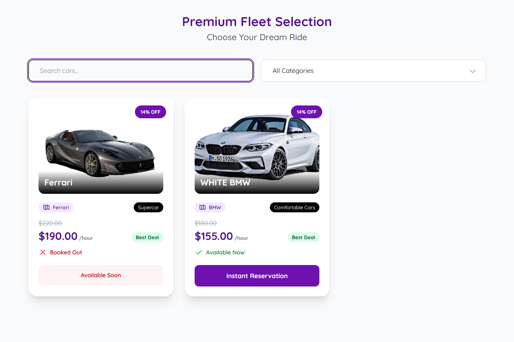
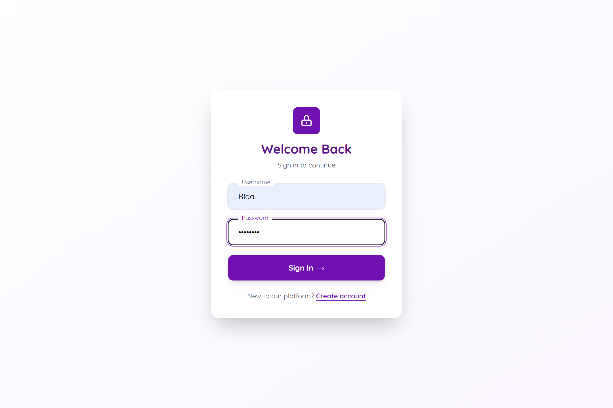
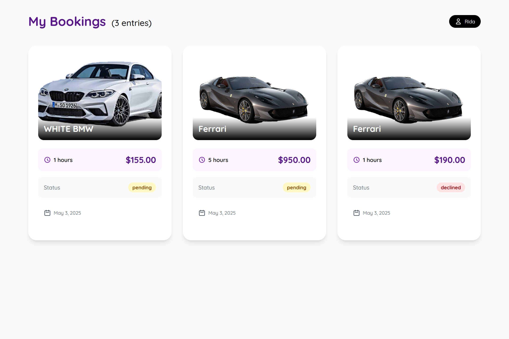
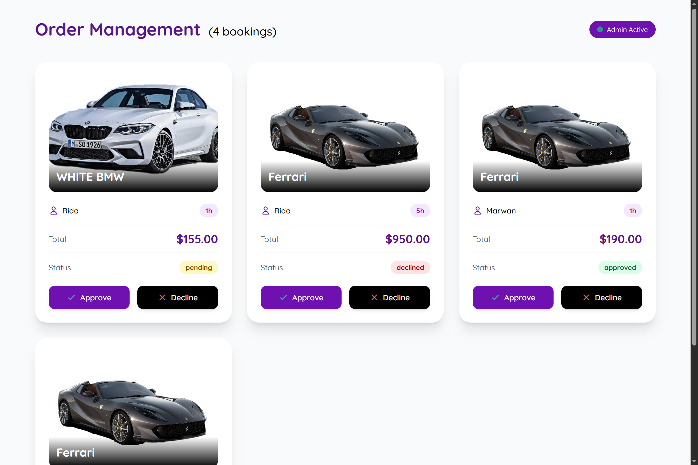
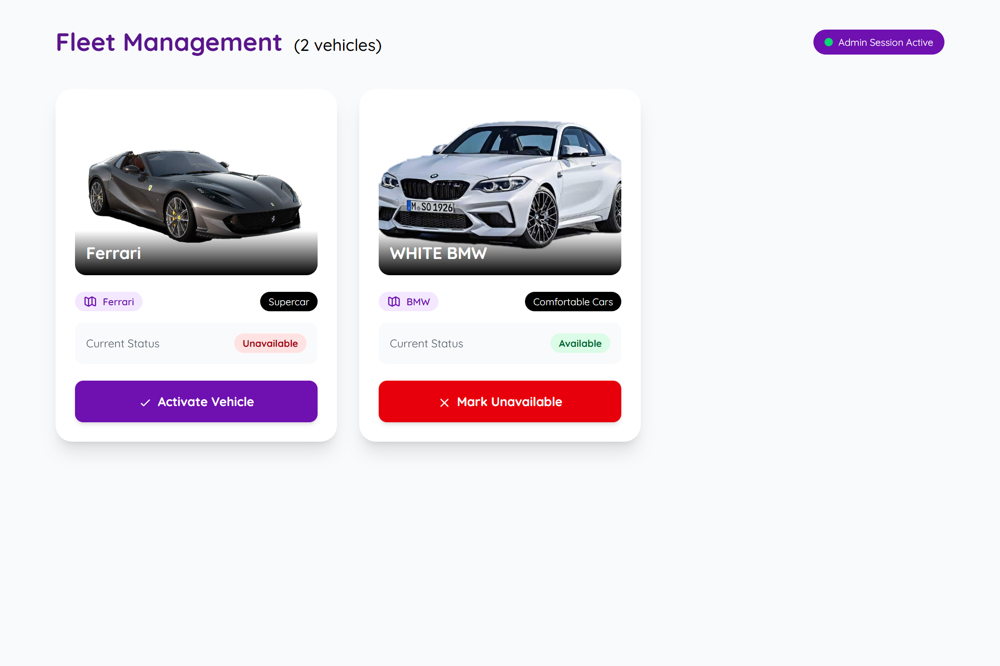
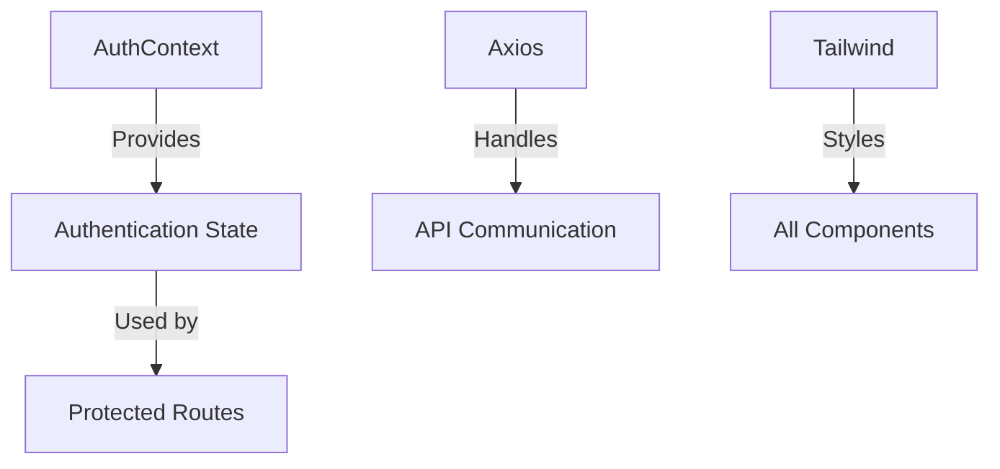

# Car Rental Management System

[](https://react.dev/)
[](https://reactrouter.com/)
[](https://tailwindcss.com/)

A full-stack car rental management system with authentication and real-time API integration.

## Application Screenshots

### User Interface
<div align="center">
  
   
  
</div>

### Admin Interface
<div align="center">
  
  
</div>


## Features
- **Cookie-based Authentication** with Axios interceptors
- **JWT Authentication** flow using `/api/me` endpoint
- **Role-based Access Control** (implied by admin routes)
- **Car Rental Management**:
  - Add new rental vehicles (`/addcar`)
  - Update vehicle details (`/updatecars`)
  - Browse available cars (`/`)
- **Rental Management**:
  - View all rentals (`/orders`)
  - Track personal rentals (`/myorders`)
- Responsive UI with Tailwind CSS
- Vite-powered development workflow

## Backend Requirements
This frontend requires a backend server running on `http://localhost:5000` with:
- Authentication endpoints (especially `/api/me`)
- CORS configured for credentials
- Car management and order APIs

## Installation
1. Clone the repository
```bash
git clone https://github.com/Rida-Lad/Car_Rental_App_Frontend.git
```
2. Install dependencies
```bash
npm install
```
3. Start development server
```bash
npm run dev
```

## Environment Setup
Ensure your backend is running on port 5000 before starting the frontend. For production, modify the API base URL in `AuthContext.jsx`.

## Key Technologies
- React 19
- React Router 7
- Context API (State Management)
- Axios (API calls)
- Tailwind CSS (Styling)
- Vite (Build tool)

## System Architecture


## Contributing
Follow these steps for development:
1. Set up backend server
2. Install frontend dependencies
3. Use `npm run dev` for development
4. Follow existing authentication patterns
